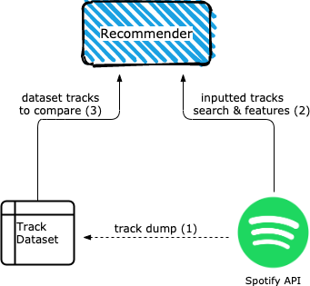
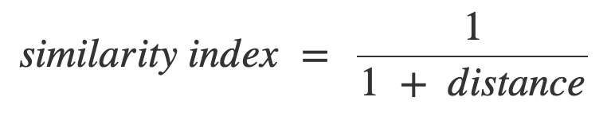

# Spotify Music Recommender
Simple recommendation system using the [Spotify web API](https://developer.spotify.com/documentation/web-api/) to get the features and analysis of tracks; initial track dataset built with [the Million Song Dataset](http://millionsongdataset.com/)

Run it on a terminal with `streamlit run main.py`

## Why?

While Spotify has all our user data and can make really good guesses at what we may like, there isn't a specific search tool because they have an approach based on exploration and user history. This application aims to be a recommender based on a tracklist you input and filters you set, like genres, year range or artist popularity.

## How does the recommender work?

First, a dataset was created using the first 200 artists from the [Million Song Dataset](http://millionsongdataset.com/) and the [Spotify web API](https://developer.spotify.com/documentation/web-api/) (**1**) by getting all the albums from those artists and dumping them in the dataset. With the data ready, the user searches in Spotify for tracks and selects up to 10 tracks to use as input (**2**), then the recommender looks in the dataset the track that has most features in common (the "shortest distance" between them) and shows them in a list (**3**).

## Features

The features evaluated are the following ([according to spotify API documentation](https://developer.spotify.com/documentation/web-api/reference/tracks/get-several-audio-features/)):
- **Acousticness**: the higher this value, a lower number of electrical amplified instruments are used
- **Danceability**: how suitable for dancing according the tempo, rhythm stability, beat strength, and overall regularity
- **Energy**: intensity and activity of the track, energetic tracks feel fast, loud and noisy
- **Instrumentalness**: the higher this value, the less vocals the track has. Values above 0.5 are considered instrumental tracks, but confidence is higher as it approaches to 1.0
- **Liveness**: represents the likelihood of the track being performed live. A value above 0.8 suggests the track is live.
- **Speechiness**: presence of spoken words in the track as:
    - Above 0.66: track made entirely of spoken words (stand up show, podcast)
    - Between 0.33 and 0.66: track with both music and speech
    - Under 0.33: mostly instrumental tracks
- **Tempo**: overall tempo of the track in beats per minute
- **Valence**: musical positiveness of the track, the higher the value, the more positive (happy, cheerful) it sounds, the lower the value the more
negative (sad, angry)

## Distance
### Explanation

The general idea is to compare the difference between all the features of the inputted tracks against the features of each of the tracks in the dataset. To do this, we use [euclidean distance](https://en.wikipedia.org/wiki/Euclidean_distance):

### Examples

*Pythagorean theorem to compute distance in 2 dimensions*

*Euclidean distance for n dimensions*

Where *p* and *q* are the tracks and the subindexes (*1*, *2*, ..., *i*, ..., *n*) are the features (acousticness, danceability, etc.)

### Similarities

So, once we get the distances we can compare the distance between the inputted track and every other one in the dataset in the following way:

And then we just pick the track that has higher similarity to the inputted track (its similarity is closest to 1.0)

## Next steps
This is only a prototype to test how well a recommender with euclidean distance works when using the features provided in the Spotify API, but it may be enhanced with the following ideas:

- Improve Exploratory Analysis
- Feed it with data from the user's [Spotify account activity](https://developer.spotify.com/documentation/web-api/reference/personalization/) instead of an inputted tracklist
- Store the track information in a database rather than using dataframes to store the tracks
- Clusterize the tracks with [kmeans](https://scikit-learn.org/stable/modules/generated/sklearn.cluster.KMeans.html) (by genre and the features with most variance)
- Output the recommended songs to a [Spotify playlist](https://developer.spotify.com/documentation/web-api/reference/playlists/)
